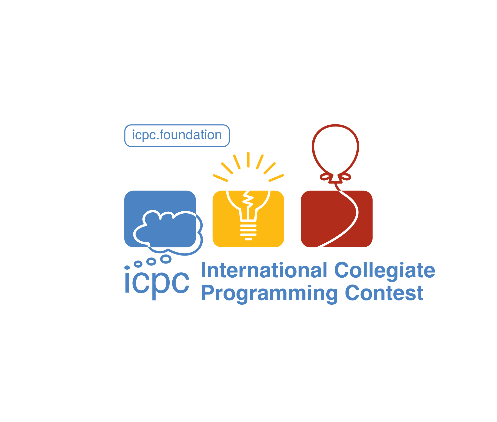

###   Hello, welcome to my profile! | ¡Hola, bienvenido a mi perfil!

**Alejandro Martínez Rivera - Computer Systems Engineer | Ingeniero en Sistemas Computacionales**

- 🧑‍💻 I am a young man passionate about software development and competitive programming.  
- 💼 Currently working on various development projects while enhancing my skills through coding competitions.

- 🧑‍💻 Soy un joven apasionado por el desarrollo de software y la programación competitiva.  
- 💼 Actualmente trabajo en varios proyectos de desarrollo mientras mejoro mis habilidades a través de concursos de codificación.

---

**About me. | Sobre mí**
- 🎓 **Name | Nombre:** Alejandro Martínez Rivera.
- 💻 **Occupation | Ocupación:** Software engineer | Ingeniero de software.
- 🌍 **Age | Edad:** 25 years old | 25 años. 
- 🚀 **Interests | Intereses:** Software development, Competitive programming, Learning new technologies | Desarrollo de software, Programación competitiva, Aprendizaje de nuevas tecnologías.
- I enjoy working on development projects and participating in competitive programming contests. You can find several repositories on my profile, and I hope you find my code helpful. 😄
- Me gusta trabajar en proyectos de desarrollo y participar en concursos de programación competitiva. Puedes encontrar diversos repositorios en mi perfil que espero te sean de ayuda. 😄

   

---

##  GitHub Statistics. | Estadísticas de GitHub.

	

		
	

	

		
	

	

	  
	

##    Technologies that I know. | Tecnologías que conozco.
<!--tech stack icons-->

	<h3>Databases | Bases de datos</h3>
    	
        
		
        
        

	<h3>Web Technologies | Tecnologías web</h3>
	
	
	
	
	
	
	
	
	
	

	<h3>Competitive programming | Programación competitiva</h3>
	
	
	
	

	<h3>Tools & Others Technologies | Herramientas y Otras Tecnologías</h3>
    
	
	 
	
	
	
	 
	
	
	
	
	
	
	
	
	
	
	
	
	
	
	
	
	
	
	
	
	
	

	<h3>Low-Code & No-Code</h3>
	
	
	
	

## Competitive programming. | Programación competitiva.

	  
  	
	
	     

---

## 🌐 Connect with me. | Conecta conmigo.

  
  

---

  

    Thank you for visiting my profile! | ¡Gracias por visitar mi perfil!
  

